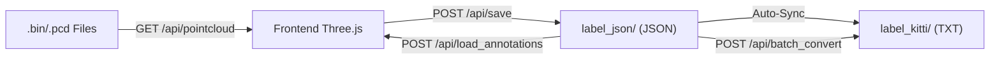

# LiDAR 3D Point Cloud Annotation Tool — Project Structure & Functional Analysis

## 1. Overview

This is a **web-based 3D LiDAR point cloud annotation tool** for annotating laser radar sequence data with 3D bounding boxes and keypoints. It adopts a frontend-backend separation architecture: a Python FastAPI backend provides data APIs, while a Three.js frontend handles 3D rendering and interaction.

---

## 2. Tech Stack

| Layer                | Technology                                                    |
| :------------------- | :------------------------------------------------------------ |
| Backend Framework    | **FastAPI** + **Uvicorn**                                     |
| Data Processing      | **NumPy** (point cloud data), **Open3D** (PCD format support) |
| Frontend Rendering   | **Three.js v0.160** (via CDN import map)                      |
| Frontend Interaction | Vanilla JS (no framework), OrbitControls, TransformControls   |
| Packaging            | **PyInstaller** (`LiDARAnnotator_Linux.spec`)                 |

---

## 3. Directory Structure

```
lidar_box_and_point_annotation_tool/
├── backend.py                  # Backend entry point (466 lines)
├── static/
│   └── index.html              # Frontend SPA (3325 lines, HTML+CSS+JS)
├── requirements.txt            # Python dependencies
├── LiDARAnnotator_Linux.spec   # PyInstaller config
├── README.md                   # English documentation
├── README_zh.md                # Chinese documentation
│
├── convert_x_to_y.py           # Utility: coordinate system migration
├── json_to_kitti_with_keypoints.py  # Utility: JSON→KITTI+Keypoints
├── generate_dummy_data.py      # Utility: generate test data
├── visualize_lidar_bin.py      # Utility: Open3D point cloud viewer
│
├── sample_data/                # Sample data (.bin and .pcd)
├── dataset_bin_output/         # Example dataset
│   ├── lidar/                  # 30 frames of .bin point clouds
│   ├── label_json/             # JSON annotation files
│   └── label_kitti/            # KITTI format annotation files
└── test/                       # Test data directory
```

---

## 4. Backend Architecture (`backend.py`)

### 4.1 API Endpoints

| Endpoint                | Method | Description                                                        |
| :---------------------- | :----- | :----------------------------------------------------------------- |
| `/api/files`            | GET    | List `.bin`/`.pcd` files in a directory, check annotation status   |
| `/api/pointcloud`       | GET    | Read point cloud file, return Nx4 float32 binary (x,y,z,intensity) |
| `/api/save`             | POST   | Save annotations (always saves JSON, syncs KITTI format)           |
| `/api/load_annotations` | POST   | Load existing annotations (prioritizes `label_json/` directory)    |
| `/api/batch_convert`    | POST   | Batch convert JSON annotations to KITTI format                     |
| `/api/debug_log`        | POST   | Receive frontend logs and print to terminal                        |

### 4.2 Key Design Decisions

- **Point Cloud Format Compatibility**: Supports Nx3, Nx4, Nx5 column `.bin` files and Open3D `.pcd` files
- **Smart Directory Search**: Automatically searches `lidar/`, `velodyne/`, `pointcloud/`, `data/` subdirectories
- **Multi-Format Sync**: Always writes JSON on save; auto-syncs KITTI format if `label_kitti/` directory exists
- **Keypoint Export**: KITTI export supports appending keypoint coordinates with automatic zero-padding alignment
- **PyInstaller Compatible**: Uses `sys._MEIPASS` for resource path resolution when packaged

---

## 5. Frontend Features (`static/index.html`)

### 5.1 UI Layout

- **Left Panel** (300px): Data directory, file list, object list, creation tools, save/export, class management, visualization settings
- **Main View**: 3D perspective camera (OrbitControls + TransformControls)
- **Right Auxiliary Views** (500px): Three orthographic camera views (Top / Side / Front), auto-tracking selected object
- **Overlays**: Frame progress, point count, shortcut cheat sheet

### 5.2 Core Features

#### Annotation Types
1. **Box**: 3D bounding box, green wireframe + cyan heading arrow
   - Supports associated sub-points that follow box transformations
   - Auto-Fit (K) and Ground Snap (G) support
2. **Point**: Independent point annotation, red sphere
3. **Point Group**: Group of multiple points, movable as a unit

#### Smart Assistance
- **Auto-Fit (K)**: Shrinks box to the internal point cloud AABB + configurable padding
- **Ground Snap (G)**: Analyzes points below the box, snaps to the average Z of the lowest 5%
- **Propagate to Next Frame**: Copies all boxes to the next frame
- **Ghost Display**: Optionally shows previous frame's annotations as semi-transparent overlays

#### Visualization
- **Coloring Modes**: Mixed / Height (Jet colormap) / Intensity (Grayscale)
- **Ground Filtering**: Z-axis clipping plane
- **Point Size Control**: Pixel mode / Depth attenuation mode
- **Round Points**: Uses CanvasTexture for circular point rendering
- **In-Box Highlighting**: Real-time yellow highlight for points inside boxes with count display

#### Class Management
- **Dual-List System**: Independent management for Box classes and Point classes
- Box classes support configurable default dimensions (L/W/H), sub-point patterns, sub-point radius
- Point classes support configurable radius and relative position patterns
- Configuration persisted to LocalStorage, import/export as JSON

#### Interaction & Shortcuts
- **Mouse**: Left-click to rotate/select, Right/Middle-click to pan, Scroll to zoom
- **Transform Tools**: 1=Translate, 2=Rotate, 3=Scale
- **Common**: W=Add Box, S=Add Point, E=Add Point Group, Del=Delete, Esc=Deselect
- **Navigation**: A/D=Previous/Next Frame
- **Undo/Redo**: ←/→ keys (up to 50 history steps)
- **Copy/Paste**: Ctrl+C/V

#### Data Flow



---

## 6. Utility Scripts

| Script                            | Description                                                                                                             |
| :-------------------------------- | :---------------------------------------------------------------------------------------------------------------------- |
| `convert_x_to_y.py`               | Coordinate migration: batch converts old (X-axis forward) annotations to new (Y-axis forward), swaps L/W + rotates -90° |
| `json_to_kitti_with_keypoints.py` | Converts JSON annotations to extended KITTI format (15 standard columns + keypoint coordinates)                         |
| `generate_dummy_data.py`          | Generates test `.bin` files (ground plane + simulated vehicle point cluster)                                            |
| `visualize_lidar_bin.py`          | Standalone Open3D point cloud sequence player (arrow keys to navigate)                                                  |

---

## 7. Data Formats

### JSON Annotation Format (Primary)
```json
{
    "file_path": "path/to/file.bin",
    "objects": [
        {
            "id": 1708000000000,
            "class_name": "Car",
            "sequence_id": 1,
            "position": {"x": 5.0, "y": 2.0, "z": -1.0},
            "scale": {"x": 1.8, "y": 4.5, "z": 1.5},
            "rotation": {"x": 0, "y": 0, "z": 0.5}
        }
    ],
    "points": [
        {
            "id": 1708000000001,
            "class_name": "Car",
            "parent_id": 1708000000000,
            "position": {"x": 5.5, "y": 2.3, "z": -0.5}
        }
    ]
}
```

### KITTI Format
```
Car 0.00 0 0.00 0 0 0 0 1.50 1.80 4.50 5.00 2.00 -1.00 0.50 [kp_x kp_y kp_z ...]
```

### Coordinate Conventions
- **Scale X = Width (W)**, **Scale Y = Length (L)**, **Scale Z = Height (H)**
- **Heading**: +Y is forward (green arrow direction), Z-axis rotation
