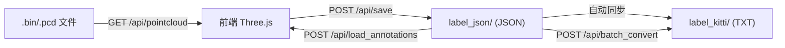

# LiDAR 3D 点云标注工具 — 项目结构与功能分析

## 一、项目概述

这是一个**基于 Web 的 3D LiDAR 点云标注工具**，用于对激光雷达序列数据进行 3D 框（Box）和关键点（Point）标注。采用前后端分离架构，后端用 Python FastAPI 提供数据 API，前端用 Three.js 实现 3D 渲染和交互。

---

## 二、技术栈

| 层级     | 技术                                                |
| :------- | :-------------------------------------------------- |
| 后端框架 | **FastAPI** + **Uvicorn**                           |
| 数据处理 | **NumPy**（点云数据）、**Open3D**（PCD格式支持）    |
| 前端渲染 | **Three.js v0.160**（通过 CDN import map）          |
| 前端交互 | 原生 JS（无框架）、OrbitControls、TransformControls |
| 打包分发 | **PyInstaller**（`LiDARAnnotator_Linux.spec`）      |

---

## 三、目录结构

```
lidar_box_and_point_annotation_tool/
├── backend.py                  # 后端主程序 (466行)
├── static/
│   └── index.html              # 前端单页面应用 (3325行，含 HTML+CSS+JS)
├── requirements.txt            # Python 依赖
├── LiDARAnnotator_Linux.spec   # PyInstaller 打包配置
├── README.md                   # 英文文档
├── README_zh.md                # 中文文档
│
├── convert_x_to_y.py           # 辅助脚本：坐标系迁移
├── json_to_kitti_with_keypoints.py  # 辅助脚本：JSON→KITTI+关键点
├── generate_dummy_data.py      # 辅助脚本：生成测试数据
├── visualize_lidar_bin.py      # 辅助脚本：Open3D 点云查看器
│
├── sample_data/                # 示例数据（含 .bin 和 .pcd）
├── dataset_bin_output/         # 示例数据集
│   ├── lidar/                  # 30帧 .bin 点云文件
│   ├── label_json/             # JSON 标注文件
│   └── label_kitti/            # KITTI 格式标注文件
└── test/                       # 测试数据目录
```

---

## 四、后端架构 (`backend.py`)

### 4.1 API 端点

| 端点                    | 方法 | 功能                                                        |
| :---------------------- | :--- | :---------------------------------------------------------- |
| `/api/files`            | GET  | 列出目录下的 `.bin`/`.pcd` 文件，并检查是否已有标注         |
| `/api/pointcloud`       | GET  | 读取点云文件，返回 Nx4 float32 二进制数据 (x,y,z,intensity) |
| `/api/save`             | POST | 保存标注（JSON 始终保存，同步更新 KITTI 格式）              |
| `/api/load_annotations` | POST | 加载已有标注（优先查找 `label_json/` 目录）                 |
| `/api/batch_convert`    | POST | 将 JSON 标注批量转换为 KITTI 格式                           |
| `/api/debug_log`        | POST | 接收前端日志在终端打印                                      |

### 4.2 关键设计

- **点云格式兼容**：支持 Nx3、Nx4、Nx5 列的 `.bin` 文件和 Open3D 的 `.pcd` 文件
- **目录智能搜索**：自动在 `lidar/`、`velodyne/`、`pointcloud/`、`data/` 子目录中搜索点云文件
- **多格式同步**：保存时始终写 JSON，如果 `label_kitti/` 目录存在则自动同步 KITTI 格式
- **关键点导出**：KITTI 导出支持追加关键点坐标，并自动对齐（零填充）
- **PyInstaller 兼容**：使用 `sys._MEIPASS` 处理打包后的资源路径

---

## 五、前端功能 (`static/index.html`)

### 5.1 界面布局

- **左侧面板**（300px）：数据目录、文件列表、标注对象列表、创建工具、保存/导出、类别管理、可视化设置
- **主视图**：3D 透视相机视图（OrbitControls + TransformControls）
- **右侧辅助视图**（500px）：三个正交相机视图（俯视 / 侧视 / 主视），选中对象时自动跟踪
- **覆盖层**：帧进度、点数统计、快捷键帮助

### 5.2 核心功能详解

#### 标注类型
1. **Box（框）**：3D 包围盒，绿色线框 + 青色朝向箭头
   - 支持关联子点（Sub-Points），子点随框移动/旋转
   - 支持自动适配尺寸（K）和地面贴合（G）
2. **Point（点）**：独立点标注，红色球体
3. **Point Group（点集）**：多个点组成的组，可整体移动

#### 智能辅助
- **Auto-Fit (K)**：收缩框到内部点云的 AABB + 边距
- **Ground Snap (G)**：分析框下方点云，贴合最低 5% 的 Z 平均值
- **传播到下一帧**：将当前帧的所有框复制到下一帧
- **残影显示**：可选显示上一帧的标注框（半透明灰色）

#### 可视化
- **着色模式**：混合模式 / 高度着色（Jet 颜色映射）/ 强度着色（灰度）
- **地面过滤**：基于 Z 轴裁剪平面
- **点大小控制**：像素模式 / 深度衰减模式
- **圆形点云**：使用 CanvasTexture 生成圆形点
- **框内点高亮**：框内点云实时高亮为黄色，并显示点数统计

#### 类别管理
- **双列表系统**：Box 类别和 Point 类别独立管理
- Box 类别可配置默认尺寸 (L/W/H)、子点模式、子点半径
- Point 类别可配置半径和相对位置模式
- 配置持久化到 LocalStorage，支持导入/导出 JSON

#### 交互与快捷键
- **鼠标**：左键旋转/选中、右键/中键平移、滚轮缩放
- **变换工具**：1=移动、2=旋转、3=缩放
- **常用**：W=添加框、S=添加点、E=添加点集、Del=删除、Esc=取消选中
- **导航**：A/D=上一帧/下一帧
- **撤销/重做**：←/→ 键（最多50步历史）
- **复制粘贴**：Ctrl+C/V

#### 数据流转



---

## 六、辅助脚本

| 脚本                              | 功能                                                                               |
| :-------------------------------- | :--------------------------------------------------------------------------------- |
| `convert_x_to_y.py`               | 坐标系迁移：将旧版（X 轴朝前）标注批量转换为新版（Y 轴朝前），交换长宽 + 旋转 -90° |
| `json_to_kitti_with_keypoints.py` | 将 JSON 标注转换为扩展 KITTI 格式（15列标准 + 关键点坐标）                         |
| `generate_dummy_data.py`          | 生成测试用 .bin 文件（含地面平面 + 模拟车辆点团）                                  |
| `visualize_lidar_bin.py`          | 使用 Open3D 的独立点云序列播放器（方向键切帧）                                     |

---

## 七、数据格式

### JSON 标注格式（核心格式）
```json
{
    "file_path": "path/to/file.bin",
    "objects": [
        {
            "id": 1708000000000,
            "class_name": "Car",
            "sequence_id": 1,
            "position": {"x": 5.0, "y": 2.0, "z": -1.0},
            "scale": {"x": 1.8, "y": 4.5, "z": 1.5},
            "rotation": {"x": 0, "y": 0, "z": 0.5}
        }
    ],
    "points": [
        {
            "id": 1708000000001,
            "class_name": "Car",
            "parent_id": 1708000000000,
            "position": {"x": 5.5, "y": 2.3, "z": -0.5}
        }
    ]
}
```

### KITTI 格式
```
Car 0.00 0 0.00 0 0 0 0 1.50 1.80 4.50 5.00 2.00 -1.00 0.50 [kp_x kp_y kp_z ...]
```

### 坐标约定
- **Scale X = 宽 (W)**、**Scale Y = 长 (L)**、**Scale Z = 高 (H)**
- **朝向**：+Y 为正前方（绿色箭头方向），Z 轴旋转
